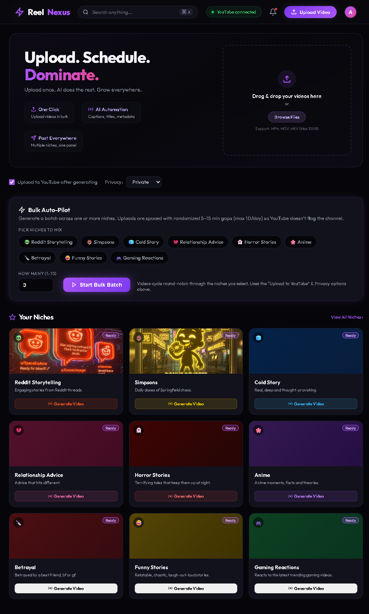
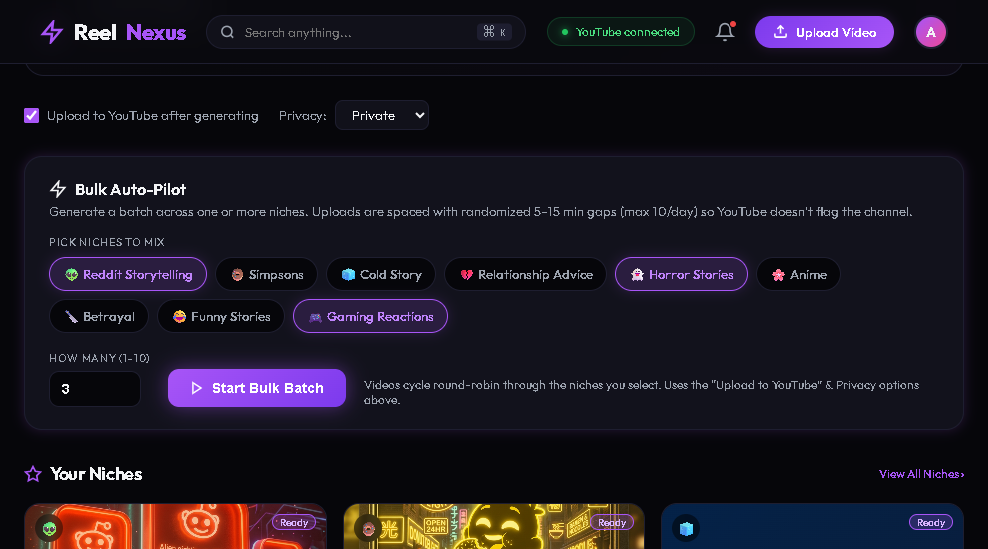
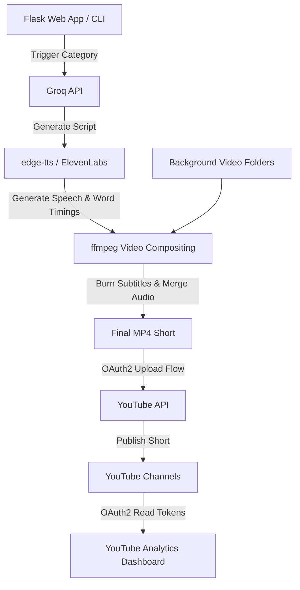

# ReelNexus: Brainrot Shorts Generator & YouTube Analytics Dashboard

A fully automated end-to-end pipeline for generating and uploading high-retention vertical videos (Shorts/Reels/TikToks) and tracking channel performance with a multi-channel YouTube analytics dashboard.

---

## 📸 Dashboards and Previews

### Main Shorts Generator Dashboard


### Bulk Queue Management


---

## 🚀 Project Overview

The project is divided into two primary sub-applications:
1. **`Brainrot` (Shorts Generator)**: A Flask web application and command-line tool that leverages LLMs (Groq), text-to-speech engine (`edge-tts` or ElevenLabs), and `ffmpeg` to auto-compile and burn word-by-word captions over background gameplay videos.
2. **`youtube_dashboard` (Analytics Center)**: A decoupled, multi-channel analytics tool that reads YouTube API tokens to show consolidated and channel-by-channel subscriber growth, view counts, watch time estimates, and top/least performing video metrics.

---

## 🛠️ Architecture and Workflow



---

## ⚙️ Configuration & Prerequisites

### 1. Requirements
* **Python 3.10+**
* **FFmpeg**: Placed locally inside `downloader/` and `shorts_generator/` (or added to system path).
* **Node.js**: Installed on your system (used by `yt-dlp` for solving client challenges during downloads).

### 2. Environment Variables (`.env`)
Create a `.env` file inside `Brainrot/shorts_generator/` with the following variables:
```env
GROQ_API_KEY=your_groq_api_key_here
YOUTUBE_API_KEY=your_youtube_api_key_here
ELEVENLABS_API_KEY=your_elevenlabs_api_key_here (optional)
```

### 3. Google OAuth & Channel Configuration
To enable automatic uploads and analytics:
1. Obtain OAuth 2.0 Credentials (`client_secret.json`) from the Google Cloud Console.
2. Place `client_secret.json` in:
   * `Brainrot/shorts_generator/`
   * `youtube_dashboard/`
3. Generate token files (`token_acc*.json`) by authorizing your YouTube channels via the Flask UI.

---

## 📂 Project Structure

```
Brainrot/
│
├── Brainrot/                         # Main video generator codebase
│   ├── shorts_generator/             # Flask generator application
│   │   ├── app.py                    # Generator web interface entry point
│   │   ├── generate.py               # Script-to-video compiler logic
│   │   ├── youtube_upload.py         # YouTube OAuth upload client
│   │   ├── config.json               # Main project configurations
│   │   ├── templates/ & static/      # UI layouts and static assets
│   │   └── fonts/                    # TTF fonts for video caption overlays
│   │
│   ├── downloader/                   # Background video batch downloader
│   │   ├── download.py               # Batch downloader using yt-dlp
│   │   └── cookies.txt               # Exported YouTube session cookies
│   │
│   ├── Bg_games/, Bg_simpsons/, etc. # Local background assets directories
│   └── output/                       # Destination for compiled shorts
│
├── youtube_dashboard/                # YouTube Analytics Dashboard
│   ├── app.py                        # Analytics web interface entry point
│   └── templates/                    # Dashboard UI layouts
│
├── .gitignore                        # Global Git exclusions
└── README.md                         # Project documentation
```

---

## 💻 How to Run

### Setup Virtual Environment
```bash
python -m venv .venv
source .venv/bin/activate  # On Windows: .venv\Scripts\activate
pip install -r Brainrot/shorts_generator/requirements.txt
```

### 1. Run Background Video Downloader
To download background video clips (Reddit, Simpsons, Horror, etc.) in batch:
```bash
python Brainrot/downloader/download.py
```
*Note: Make sure your `config.json` background directories match your system paths.*

### 2. Run the Shorts Generator Web App
```bash
cd Brainrot/shorts_generator
python app.py
```
Access the generator UI at `http://127.0.0.1:5000`. Here, you can generate videos for different niches, review logs in real-time, preview generated media, and trigger uploads.

### 3. Run the Analytics Dashboard
```bash
cd youtube_dashboard
python app.py
```
Access the analytics UI at `http://127.0.0.1:5000` (or configured port). Scan and track views, watch time, subscriber counts, and detailed metrics for all linked YouTube channels.

---

## 🛡️ Security Note
The `.gitignore` is pre-configured to ensure that **no credentials, cookies, local `.env` files, or OAuth secret JSON keys** are committed to Git. Keep your tokens safe!
